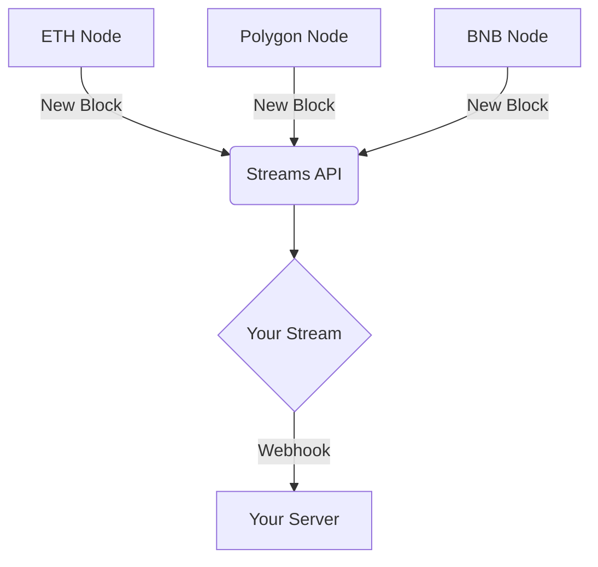

## What is the Streams API?

With Streams API you can listen for real time events on chain, you can listen for when a new event is emitted in your contract or for when a walltet address does an NFT transfer or a transaction. You can also get notifications for native and internal transactions. You will receive webhook requests for those events specific to your stream configuration.

## Working With Webhooks

Webhooks allow you to receive real-time notifications for events that are happening in relation to your application. When a supported event occurs, a real-time notification is posted, including a data payload, via HTTP POST method to a custom URL you provide.

## Streams API features

- Get blockchain events streamed to your backend directly in real-time
- Listen to wallets or contract events, or both with multiple streams
- Track one address or millions with just one stream, it is up to you
- Fully customize your streams using filters, you want to only want to listen to transactions over 1000 USDT, no problem
- Listen for events from all contract addresses
- Add your custom ABI and choose which events you want to listen too
- and much more...

## Popular use cases

- Realtime Wallet notifications (monitor when an address sends, receives, stakes, swaps, or burns assets)
- Monitor assets (get notifications when an asset is being sent, received, staked, swapped, or burned)
- In game specific events, for example when a battle starts in your web3 game
- Token sales (get notifications for when someone participates in your token sale)
- Any other smart contract event fires on-chain based on your filters

### Listen to all addresses use cases

- Listen to all NFT contract transfers [tutorial](/streams-api/how-to-listen-all-nft-transfers)
- Listen to all events from new contracts specific to a contract factory [tutorial](/streams-api/how-to-listen-all-events-from-a-contract-factory)
- Listen to all NFT contracts transfers where sender is a specific address [tutorial](/streams-api/how-to-listen-to-all-nft-transfers-sent-from-a-specific-address)
- Listen to all ERC20 contract transfers where sender is a specific address and number of coins transferred is over 1000 [tutorial](/streams-api/how-to-listen-to-all-erc20-contract-transfers-over-certain-amount-sent-by-specific-address)

## Run Smart Contract Functions

- Run smart contract functions against Events [Read more here!](/streams-api/triggers)

## Get Native Balances

- Get Native Balances for addresses! [Read more here!](/streams-api/get-native-balances)

## High reliability

- Moralis guarantees 100% delivery of Webhooks
- If your service is down Moralis will retry to send the webhook in intervals
- If your service fails to receive the webhooks you can manually replay

## Supported chains

| Chain         | Chain Id (HEX) | Internal Transaction Supported | Note                                    | Blocks until confirmed |
| :------------ | :------------- | :----------------------------- | :-------------------------------------- | :--------------------- |
| ETH           | 0x1            | ✅ YES                         |                                         | 12                     |
| GOERLI        | 0x5            | ✅ YES                         |                                         | 12                     |
| SEPOLIA       | 0xaa36a7       | ✅ YES                         |                                         | 18                     |
| BNB           | 0x38           | ✅ YES                         |                                         | 18                     |
| BNB TEST      | 0x61           | ✅ YES                         |                                         | 18                     |
| POLYGON       | 0x89           | ✅ YES                         |                                         | 100                    |
| MUMBAI        | 0x13881        | ✅ YES                         |                                         | 100                    |
| FANTOM TEST   | 0xfa2          | ✅ YES                         |                                         | 100                    |
| FANTOM        | 0xfa           | ✅ YES                         |                                         | 100                    |
| AVAX          | 0xa86a         | ✅ YES                         |                                         | 100                    |
| AVAX TEST     | 0xa869         | ✅ YES                         |                                         | 100                    |
| CRONOS        | 0x19           | ❌ Very soon                   | Planned support within a couple of days | 100                    |
| CRONOS TEST   | 0x152          | ❌ Very soon                   | Planned support within a couple of days | 100                    |
| RONIN         | 0x7e4          | ✅ YES                         | 🔥 NEW                                  | 100                    |
| ARBITRUM      | 0xa4b1         | ✅ YES                         | 🔥 NEW                                  | 100                    |
| ARBITRUM TEST | 0x66eed        | ✅ YES                         | 🔥 NEW                                  | 100                    |
| OPTIMISM      | 0xa            |                                | 🔥 NEW                                  | 100                    |
| PALM          | 0x2a15c308d    |                                | 🔥 NEW                                  | 100                    |
| APTOS MAINNET | mainnet        | Not Applicable                 | 🔥 NEW                                  | Not Applicable         |
| APTOS TESTNET | testnet        | Not Applicable                 | 🔥 NEW                                  | Not Applicable         |

:::info Reorgnization Before Confirmation
Until a block is confirmed, it is possible that a re-organization of the chain may occur, invalidating some information. If a re-organization does occur before a block is confirmed, the information associated with the block is deleted and the updated block is inserted in its place.
:::

## To get started, check the following tutorials:

- [Your First Stream using NodeJS SDK](/streams-api/using-node-js-sdk)
- [Your First Stream using WebUI](/streams-api/using-webui)
- You can also use the [Swagger Interface](https://api.moralis-streams.com/api-docs/) directly.

## How Streams are priced

See [Records and pricing](/streams-api/records-and-pricing)

## Learn more advanced applications of Streams

- [Monitor specific NFTs](/streams-api/how-to-monitor-specific-nfts)
- [Monitor for Burn/Mint Tokens](/streams-api/how-to-monitor-for-erc20-token-burns-or-mints)
- [Monitor ENS Name Registrations](/streams-api/how-to-monitor-ens-domain-registrations)

## Demos

https://www.youtube.com/watch?v=KL3Sdsu50Jc
