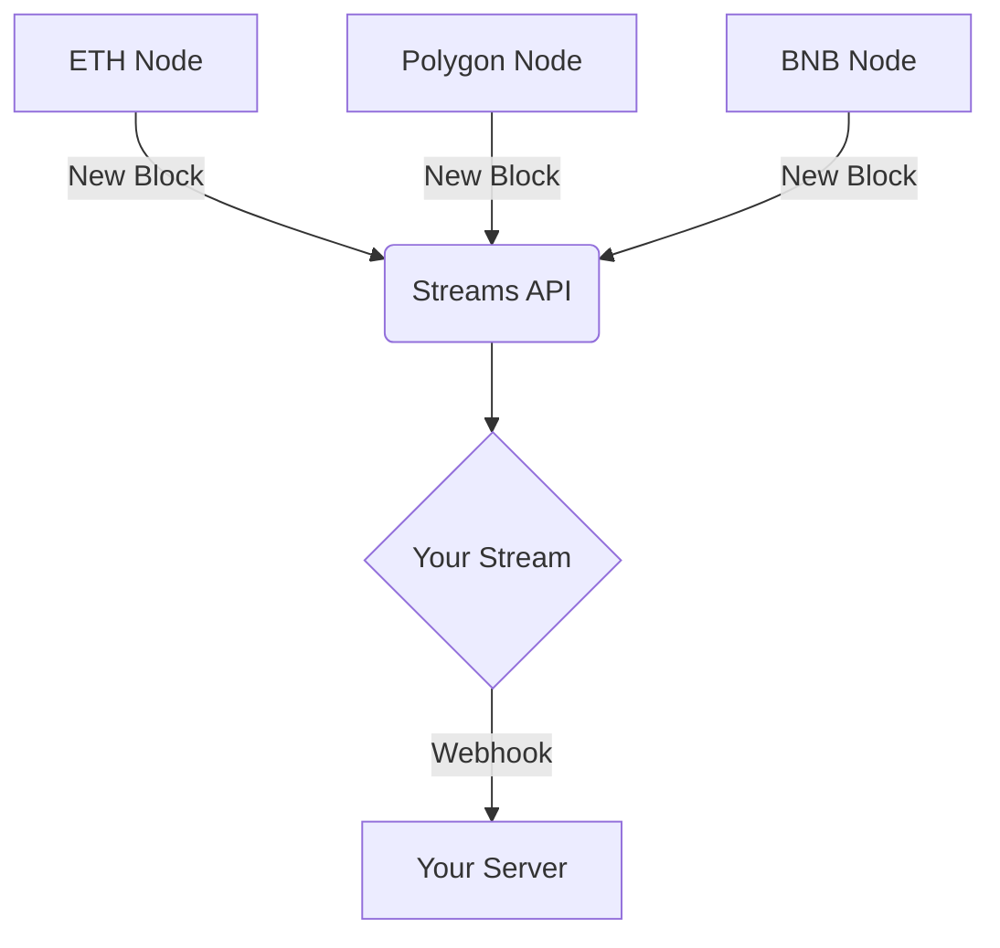

<Tip>
  You can learn by [watching the Streams API Demo](#demos).
</Tip>

## What is the Streams API?

You can also get notifications for native and internal transactions. You will receive webhook requests for those events specific to your stream configuration.

## Working With Webhooks

Webhooks allow you to receive real-time notifications for events that are happening in relation to your application. When a supported event occurs, a real-time notification is posted, including a data payload, via HTTP POST method to a custom URL you provide.

## Streams API features

- Get blockchain events streamed to your backend directly in real-time
- Listen to wallets or contract events, or both with multiple streams
- Track one address or millions with just one stream, it is up to you
- Fully customize your streams using filters, you want to only want to listen to transactions over 1000 USDT, no problem
- Listen for events from all contract addresses
- Add your custom ABI and choose which events you want to listen too
- and much more...

## Popular use cases

- Realtime Wallet notifications (monitor when an address sends, receives, stakes, swaps, or burns assets)
- Monitor assets (get notifications when an asset is being sent, received, staked, swapped, or burned)
- In game specific events, for example when a battle starts in your web3 game
- Token sales (get notifications for when someone participates in your token sale)
- Any other smart contract event fires on-chain based on your filters

### Listen to all addresses use cases

- Listen to all NFT contract transfers [tutorial](https://docs.moralis.com/streams-api/evm/how-to-listen-all-nft-transfers)
- Listen to all events from new contracts specific to a contract factory [tutorial](https://docs.moralis.com/streams-api/evm/how-to-listen-all-events-from-a-contract-factory)
- Listen to all NFT contracts transfers where sender is a specific address [tutorial](https://docs.moralis.com/streams-api/evm/how-to-listen-to-all-nft-transfers-sent-from-a-specific-address)
- Listen to all ERC20 contract transfers where sender is a specific address and number of coins transferred is over 1000 [tutorial](https://docs.moralis.com/streams-api/evm/how-to-listen-to-all-erc20-contract-transfers-over-certain-amount-sent-by-specific-address)

## Run Smart Contract Functions

- Run smart contract functions against Events [Read more here\!](https://docs.moralis.com/streams-api/evm/triggers)

## Get Native Balances

- Get Native Balances for addresses\! [Read more here\!](https://docs.moralis.com/streams-api/evm/get-native-balances)

## High Reliability

- Moralis guarantees 100% delivery of Webhooks
- If your service is down Moralis will retry to send the webhook in intervals
- If your service fails to receive the webhooks you can manually replay

## Supported Chains

<Note>
  ### Reorgnization Before Confirmation

  Until a block is confirmed, it is possible that a re-organization of the chain may occur, invalidating some information. If a re-organization does occur before a block is confirmed, the information associated with the block is deleted and the updated block is inserted in its place.
</Note>

<Tip>
  ### Supported Chains

  See the table below for all supported chains we support on Streams. For wider chains we support across all products, check the [**full list of supported chains.**](https://docs.moralis.com/supported-chains)
</Tip>

| Name                                                                                                                                 | Type    | Chain ID            | EvmChain                    | Internal Transaction Support | Blocks Until Confirmed |
| ------------------------------------------------------------------------------------------------------------------------------------ | ------- | ------------------- | --------------------------- | ---------------------------- | ---------------------- |
| 
 <Icon icon="https://docs.moralis.com/img/content/eth.png" /> Ethereum Mainnet
            | Mainnet | 0x1 (1)             | `EvmChain.ETHEREUM`         |                              | 12                     |
| 
 <Icon icon="https://docs.moralis.com/img/content/eth.png" /> Ethereum Sepolia
            | Testnet | 0xaa36a7 (11155111) | `EvmChain.SEPOLIA`          |                              | 18                     |
| 
 <Icon icon="https://docs.moralis.com/img/content/eth.png" /> Ethereum Holesky
            | Testnet | 0x4268 (17000)      | `EvmChain.HOLESKY`          |                              | 18                     |
| 
 <Icon icon="https://docs.moralis.com/img/content/polygon.png" /> Polygon Mainnet
         | Mainnet | 0x89 (137)          | `EvmChain.POLYGON`          |                              | 100                    |
| 
 <Icon icon="https://docs.moralis.com/img/content/polygon.png" /> Polygon Amoy
            | Testnet | 0x13882 (80002)     | `EvmChain.POLYGON_AMOY`     |                              | 100                    |
| 
 <Icon icon="https://docs.moralis.com/img/content/bsc.png" /> Binance Smart Chain Mainnet
 | Mainnet | 0x38 (56)           | `EvmChain.BSC`              |                              | 18                     |
| 
 <Icon icon="https://docs.moralis.com/img/content/bsc.png" /> Binance Smart Chain Testnet
 | Testnet | 0x61 (97)           | `EvmChain.BSC_TESTNET`      |                              | 18                     |
| 
 <Icon icon="https://docs.moralis.com/img/content/arbitrum.png" /> Arbitrum
               | Mainnet | 0xa4b1 (42161)      | `EvmChain.ARBITRUM`         |                              | 18                     |
| 
 <Icon icon="https://docs.moralis.com/img/content/arbitrum.png" /> Arbitrum Sepolia
       | Testnet | 0x66eee (421614)    | `EvmChain.ARBITRUM_SEPOLIA` |                              | 600                    |
| 
 <Icon icon="https://docs.moralis.com/img/content/base.png" /> Base
                       | Mainnet | 0x2105 (8453)       | `EvmChain.BASE`             |                              | 100                    |
| 
 <Icon icon="https://docs.moralis.com/img/content/base.png" /> Base Sepolia
               | Testnet | 0x14a34 (84532)     | `EvmChain.BASE_SEPOLIA`     |                              | 100                    |
| 
 <Icon icon="https://docs.moralis.com/img/content/optimism.png" /> Optimism
               | Mainnet | 0xa (10)            | `EvmChain.OPTIMISM`         |                              | 500                    |
| 
 <Icon icon="https://docs.moralis.com/img/content/optimism.png" /> Optimism Sepolia
       | Testnet | 0xaa37dc (11155420) | `EvmChain.OPTIMISM_SEPOLIA` |                              | 600                    |
| 
 <Icon icon="https://docs.moralis.com/img/content/linea.png" /> Linea
                     | Mainnet | 0xe708 (59144)      | `EvmChain.LINEA`            |                              | 100                    |
| 
 <Icon icon="https://docs.moralis.com/img/content/linea.png" /> Linea Sepolia
             | Testnet | 0xe705 (59141)      | `EvmChain.LINEA_SEPOLIA`    |                              | 100                    |
| 
 <Icon icon="https://docs.moralis.com/img/content/avalanche.png" /> Avalanche
             | Mainnet | 0xa86a (43114)      | `EvmChain.AVALANCHE`        |                              | 100                    |
| 
 <Icon icon="https://docs.moralis.com/img/content/fantom.png" /> Fantom Mainnet
           | Mainnet | 0xfa (250)          | `EvmChain.FANTOM`           |                              | 100                    |
| 
 <Icon icon="https://docs.moralis.com/img/content/fantom.png" /> Fantom Testnet
           | Testnet | 0xfa2 (4002)        | `EvmChain.FANTOM_TESTNET`   |                              | 100                    |
| 
 <Icon icon="https://docs.moralis.com/img/content/cronos.png" /> Cronos Mainnet
           | Mainnet | 0x19 (25)           | `EvmChain.CRONOS`           | Unsupported                  | 100                    |
| 
 <Icon icon="https://docs.moralis.com/img/content/gnosis.png" /> Gnosis
                   | Mainnet | 0x64 (100)          | `EvmChain.GNOSIS`           | Unsupported                  | 100                    |
| 
 <Icon icon="https://docs.moralis.com/img/content/gnosis.png" /> Gnosis Chiado
            | Testnet | 0x27d8 (10200)      | `EvmChain.GNOSIS_TESTNET`   | Unsupported                  | 100                    |
| 
 <Icon icon="https://docs.moralis.com/img/content/chiliz.png" /> Chiliz Mainnet
           | Mainnet | 0x15b38 (88888)     | `EvmChain.CHILIZ`           |                              | 100                    |
| 
 <Icon icon="https://docs.moralis.com/img/content/chiliz.png" /> Chiliz Testnet
           | Testnet | 0x15b32 (88882)     | `EvmChain.CHILIZ_TESTNET`   |                              | 100                    |
| 
 <Icon icon="https://docs.moralis.com/img/content/moonbeam.png" /> Moonbeam
               | Mainnet | 0x504 (1284)        | `EvmChain.MOONBEAM`         | Unsupported                  | 100                    |
| 
 <Icon icon="https://docs.moralis.com/img/content/moonbeam.png" /> Moonriver
              | Testnet | 0x505 (1285)        | `EvmChain.MOONRIVER`        | Unsupported                  | 100                    |
| 
 <Icon icon="https://docs.moralis.com/img/content/moonbeam.png" /> Moonbase
               | Testnet | 0x507 (1287)        | `EvmChain.MOONBASE`         | Unsupported                  | 100                    |
| 
 <Icon icon="https://docs.moralis.com/img/content/flow.png" /> Flow
                       | Mainnet | 0x2eb (747)         | `EvmChain.FLOW`             |                              | 100                    |
| 
 <Icon icon="https://docs.moralis.com/img/content/flow.png" /> Flow Testnet
               | Testnet | 0x221 (545)         | `EvmChain.FLOW_TESTNET`     |                              | 100                    |
| 
 <Icon icon="https://docs.moralis.com/img/content/ronin.png" /> Ronin
                     | Mainnet | 0x7e4 (2020)        | `EvmChain.RONIN`            |                              | 100                    |
| 
 <Icon icon="https://docs.moralis.com/img/content/ronin.png" /> Ronin Saigon Testnet
      | Testnet | 0x7e5 (2021)        | `EvmChain.RONIN_TESTNET`    |                              | 100                    |
| 
 <Icon icon="https://docs.moralis.com/img/content/lisk.png" /> Lisk
                       | Mainnet | 0x46f (1135)        | `EvmChain.LISK`             |                              | 100                    |
| 
 <Icon icon="https://docs.moralis.com/img/content/lisk.png" /> Lisk Sepolia Testnet
       | Testnet | 0x106a (4202)       | `EvmChain.LISK_SEPOLIA`     |                              | 100                    |
| 
 <Icon icon="https://docs.moralis.com/img/content/pulsechain.png" /> Pulsechain
           | Mainnet | 0x171 (369)         | `EvmChain.PULSECHAIN`       |                              | 100                    |

## To get started, check the following tutorials:

- [Your First Stream using NodeJS SDK](https://docs.moralis.com/streams-api/evm/using-node-js-sdk)
- [Your First Stream using WebUI](https://docs.moralis.com/streams-api/evm/using-webui)
- You can also use the [Swagger Interface](https://api.moralis-streams.com/api-docs/) directly.

## How Streams are priced

See [Records and pricing](https://docs.moralis.com/streams-api/evm/records-and-pricing)

## Learn more advanced applications of Streams

- [Monitor specific NFTs](https://docs.moralis.com/streams-api/evm/how-to-monitor-specific-nfts)
- [Monitor for Burn/Mint Tokens](https://docs.moralis.com/streams-api/evm/how-to-monitor-for-erc20-token-burns-or-mints)
- [Monitor ENS Name Registrations](https://docs.moralis.com/streams-api/evm/how-to-monitor-ens-domain-registrations)

## Demos

<Frame>
  <iframe width="100%" height="420" src="https://www.youtube.com/embed/pnmVhxdUBao" title="Monitor Crypto Wallet Addresses - Beginner Introduction To Moralis Streams" frameborder="0" allow="accelerometer; autoplay; clipboard-write; encrypted-media; gyroscope; picture-in-picture; web-share" referrerpolicy="strict-origin-when-cross-origin" allowfullscreen />
</Frame>